## EJERCICIOS EBAU FENÓMENOS ONDULATORIOS Y ÓPTICA (FÍSICA) 2025/26

# FENÓMENOS ONUDULATORIOS

- 1) Razone si la siguiente afirmación es verdadera o falsa: "Si dos ondas se propagan con la misma velocidad, la difracción que experimentan sus frentes de ondas al alcanzar un orificio dependerá del valor de su frecuencia". EBAU 2022
- 2) Cuando una onda se propaga pasando de un medio A a otro medio B, su longitud de onda se reduce a la mitad. Razone cómo se modifican su velocidad de propagación y su periodo al pasar de A a B. EBAU 2021
- 3) Una onda pasa de un medio en el que su velocidad de propagación es v1 a otro en que la velocidad es v2 > v1 ¿Cómo cambian la longitud de onda, la frecuencia y la dirección de propagación? EBAU 2022
- 4) Cuando una onda que se propaga en un medio A pasa a otro medio B, se reduce su longitud de onda a la mitad. ¿Cómo se modifica la velocidad de propagación de la onda en el segundo medio respecto al primero? ¿Y su periodo? Razone las respuestas. EBAU 2024

#### ÓPTICA FÍSICA

- 1) Un haz de luz, de frecuencia 3,5·1014 Hz, incide desde el aire sobre un material de índice de refracción 1,35. Si el haz incidente forma un ángulo de 60° con la superficie de separación entre ambos medios, determine la longitud de onda de la luz en el material y el ángulo que forman los rayos reflejado y refractado. EBAU 2021
- 2) Un haz de luz incide desde el aire sobre un bloque de vidrio formando un ángulo de 43° con la normal a la superficie de separación de ambos medios. Parte del haz se refleja y parte se refracta, formando los haces reflejado y refractado un ángulo de 110°. Determine la velocidad de la luz en el vidrio. EBAU 2021
- 3) Un rayo incide desde el aire sobre un medio con índice de refracción n. Si el ángulo de incidencia es 60° y el ángulo que forman el rayo reflejado y el transmitido es 90°, ¿cuál es el valor de n? EBAU 2022
- 4) Un rayo luminoso entra en un acuario limitado por una pared vertical de vidrio de un cierto espesor. Si el rayo incide desde el aire sobre el vidrio formando un ángulo de 30° con la normal,
- a) Calcule el ángulo que forma el rayo que entra en el agua con la pared de vidrio.
- **b)** Calcule la velocidad y la longitud de onda de la luz en el agua, sabiendo que tiene una longitud de onda  $$\lambda = 5 \cdot 10^{-7}$$  m en el aire.

Dato: Índice de refracción del agua: n = 1,33. EBAU 2018

- 5) Un haz de luz viaja por el agua a una velocidad  $$v = 2,25 \cdot 10^8 \,\mathrm{m\ s^{-1}}$$ . Determine el valor mínimo del ángulo de incidencia sobre la superficie de separación agua-aire, para que no emerja al aire. Realice un diagrama de la marcha de rayos para el ángulo calculado y para otro ángulo mayor. EBAU 2020
- 6) a) Explique en qué consiste el fenómeno de la reflexión total de la luz. Represente mediante esquemas la trayectoria de un rayo para los siguientes casos: ángulo de incidencia menor, igual y mayor que el ángulo límite.
- b) Si el índice de refracción del agua es 1,33 y el del aire es 1, determine en qué condiciones se produce el fenómeno de la reflexión total en la superficie de separación de los medios y el valor del ángulo límite correspondiente. EBAU 2018

- 7) Razone si el siguiente enunciado es verdadero o falso: "El ángulo límite de un material para que se produzca reflexión total es el mismo cuando se incide desde el material hacia el aire que cuando se incide desde el material hacia el agua". EBAU 2022
- 8) Un rayo de luz viaja por el interior del diamante a una velocidad de 1,25·108 m·s-1. Determine el ángulo mínimo de incidencia para que se produzca reflexión total entre el diamante y el aire. EBAU 2020
- 9) Un rayo luminoso incide desde el aire sobre un líquido, formando un ángulo de 30° con la normal a la superficie de separación aire-líquido. El rayo refractado y el rayo reflejado forman un ángulo de 130°.
  - a) Determine la velocidad de propagación de la luz en el líquido.
  - **b)** Otro rayo luminoso se propaga desde el líquido al aire. Determine el ángulo de incidencia a partir del cual se produce reflexión total. EBAU 2019
- 10) Un rayo de luz incide desde el aire sobre la superficie lateral de un largo bloque rectangular de vidrio ( $$n_V = 1,62$$ ), sobre el que existe una película de agua ( $$n_A = 1,33$$ ). Determine el máximo valor del ángulo  $$\alpha$$  para que el rayo se refleje completamente en la cara superior del bloque. EBAU 2022

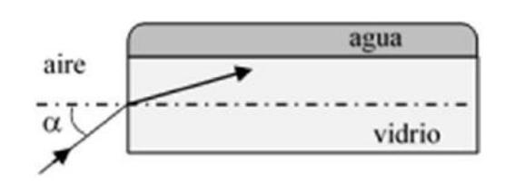

- 11) Consideremos un vaso de agua (índice de refracción n3 = 1,33) en cuya superficie hay una capa de aceite (índice de refracción  $$n_2 = 1,45$$ ). (ver figura).
- a) Un rayo incide desde el aire (índice de refracción nl = 1) formando un ángulo de  $$40^{\circ}$$  con la normal, como se indica en la figura. Dibuje la marcha de rayos y determine el ángulo de salida del rayo en el agua.
- **b)** Si consideramos ahora un rayo procedente del agua, determine el ángulo de incidencia mínimo en la superficie agua-aceite para que no emerja luz al aire.

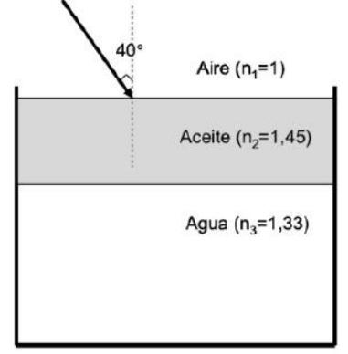

- 12) Un rayo láser incide desde el aire sobre la superficie plana de un material con un índice de refracción 1,55. El rayo incidente y el reflejado forman entre sí un ángulo de 60°. Dibuje el diagrama de rayos correspondiente y calcule el ángulo que formará el rayo refractado en el material con el rayo reflejado en el aire. EBAU 2023
- 13) El índice de refracción de un cierto líquido para la luz de color rojo es 1,32 mientras que para el color violeta es 1,35. Sobre un recipiente de 50 cm de altura lleno de este líquido se hace incidir un rayo de luz blanca formando un ángulo de 60° con la superficie del líquido. Determine la separación entre los rayos rojo y violeta cuando alcancen el fondo del recipiente. EBAU 2023
- 14) Un buceador enciende una linterna bajo el agua (índice de refracción nagua = 1,33) y dirige el haz luminoso hacia arriba formando un ángulo de 40° con la vertical. ¿Con qué ángulo emergerá la luz del agua? ¿Cuál sería el ángulo de incidencia a partir del cual el haz no saldría al aire? EBAU 2024
- 15) Un rayo de luz de frecuencia 5,2·1014 Hz incide desde el agua (nagua = 1,33) sobre la superficie de separación agua-aire de un lago, formando un ángulo de 60° respecto a la superficie del agua.

  Determine la longitud de onda del rayo en cada uno de los medios y el ángulo que forman entre sí el rayo reflejado y el refractado. EBAU 2024

16) Un haz de luz pasa de un medio en el que su velocidad de propagación es v1 a otro en el que su velocidad es v2, siendo v2 > v1. Razone si puede tener lugar el fenómeno de reflexión total. EBAU 2024

17) El rayo de luz de la figura se propaga por el interior de cierto medio e incide sobre la superficie que lo separa del aire. Las dimensiones mostradas en el diagrama corresponden justamente al ángulo límite. Determine el índice de refracción del medio. PAUor 2025. (1 punto)

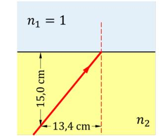

18) La esquina inferior de una piscina se encuentra a 2 m bajo la superficie del agua (n = 1,33). Desde esa esquina se emite un rayo de luz hacia arriba, que llega a la superficie del agua formando un ángulo de 40° con la vertical. a) ¿Cuál es la velocidad de la luz en el agua? ¿Qué ángulo forma con la vertical el rayo que sale del agua? (1 punto) b) Si un observador percibe este rayo, ¿a qué profundidad le parece que está la esquina de la piscina? (1 punto). PAUex 2025

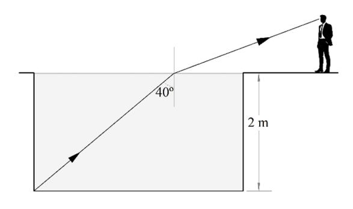

## MATRIZ DE ESPECIFICACIONES DE LA ASIGNATURA DE FÍSICA

| BLOQUE                  | SABERES BÁSICOS                                                                                                                                                                                                                                                                                                                                                 | COCRECIONES                                                                                                                                                                                                                                                                                                                                                                                                                                                                                                             |
|-------------------------|-----------------------------------------------------------------------------------------------------------------------------------------------------------------------------------------------------------------------------------------------------------------------------------------------------------------------------------------------------------------|-------------------------------------------------------------------------------------------------------------------------------------------------------------------------------------------------------------------------------------------------------------------------------------------------------------------------------------------------------------------------------------------------------------------------------------------------------------------------------------------------------------------------|
| C.: Vibraciones y ondas | -Fenómenos ondulatorios: situaciones y contextos naturales en los que se ponen de manifiesto distintos fenómenos ondulatorios y aplicaciones Cambios en las propiedades de las ondas en función del desplazamiento del emisor y receptorNaturaleza de la luz: controversias y debates históricos. La luz como onda electromagnética. Espectro electromagnético. | -La propagación de las ondas empleando el principio de HuygensLa interferencia y la difracción de ondas a partir del principio de Huygens Comportamiento de la luz al cambiar de medio con distinto índice de refracción. La ley de SnellDeterminación del índice de refracción de un medio a partir del ángulo formado por la onda reflejada y refractadaEl fenómeno de reflexión total como el principio físico subyacente a la propagación de la luz en las fibras óptica y su relevancia en las telecomunicaciones. |

| CONSTANTES FÍSICAS                                    |                                                                                |  |
|-------------------------------------------------------|--------------------------------------------------------------------------------|--|
| Aceleración de la gravedad en la superficie terrestre | $$g_0 = 9,80 \text{ m s}^{-2}$$                                                  |  |
| Constante de gravitación universal                    | $$G = 6.67 \cdot 10^{-11} \text{ N m}^2 \text{ kg}^{-2}$$                        |  |
| Radio medio de la Tierra                              | $$R_{\rm T} = 6.37 \cdot 10^6  \rm m$$                                           |  |
| Masa de la Tierra                                     | $$M_{\rm T} = 5.98 \cdot 10^{24}  \rm kg$$                                       |  |
| Constante eléctrica en el vacío                       | $$K_0 = 1/(4 \pi \varepsilon_0) = 9,00 \cdot 10^9 \text{ N m}^2 \text{ C}^{-2}$$ |  |
| Permeabilidad magnética del vacío                     | $$\mu_0 = 4 \pi \cdot 10^{-7} \text{ N A}^{-2}$$                                 |  |
| Carga elemental                                       | $$e = 1,60 \cdot 10^{-19} \text{ C}$$                                            |  |
| Masa del electrón                                     | $$m_{\rm e} = 9.11 \cdot 10^{-31}  \rm kg$$                                      |  |
| Masa del protón                                       | $$m_{\rm p} = 1.67 \cdot 10^{-27} \mathrm{kg}$$                                  |  |
| Velocidad de la luz en el vacío                       | $$c_0 = 3.00 \cdot 10^8 \text{ m s}^{-1}$$                                       |  |
| Constante de Planck                                   | $$h = 6.63 \cdot 10^{-34} \text{ J s}$$                                          |  |
| Unidad de masa atómica                                | $$1 \text{ u} = 1,66 \cdot 10^{-27} \text{ kg}$$                                 |  |
| Electronvoltio                                        | $$1 \text{ eV} = 1,60 \cdot 10^{-19} \text{ J}$$                                 |  |
| Número de Avogadro                                    | $$N_{\rm A} = 6,022 \cdot 10^{23}  \text{mol}^{-1}$$                             |  |

1) Razone si la siguiente afirmación es verdadera o falsa: "Si dos ondas se propagan con la misma velocidad, la difracción que experimentan sus frentes de ondas al alcanzar un orificio dependerá del valor de su frecuencia" FRALL 2022

La difracción es el fenómeno que se produce wando una onda se enwentra con un obstaculo o una rendiza de tamaño comparable a la longitud de onda. Por el principio de Huygens, los puntos del frente de onda que no estan tapadas por el obstaculo se convierten en centros envisores de nuevos frentes de onda, logrando bordear to el obstacilo, es decir cambiando la dirección de propagación, y llegando a zonas de sombra. teorica. Por tanto, la difracción depende de la longitud de onda, si la velocidad de las das ondas es la misma y V= == >d, concluimos que la longitud de onda depende de la frewencia y por tanto; la afirmación es cierta.

2) Cuando una onda se propaga pasando de un medio A a otro medio B, su longitud de onda se reduce a la mitad. Razone cómo se modifican su velocidad de propagación y su periodo al pasar de A a B. EBAU 2021

Cuando una onda pasa de un medio A a otro B, su frecuencia se mantiene constante. Por tanto, dado que T = 1, el periodo tampoco variará. Como la velocidad depende de la longitud de onda i y el periodo T y este sitimo no vanta, podemos expresar que:  $V_B = \frac{\lambda_B}{T} = \frac{\Lambda_{12}}{T} = \frac{1}{2} \frac{\lambda_A}{T} = \frac{1}{2} V_A$ . Por tanto, la velocidad se reduce a la nuitad.

3) Una onda pasa de un medio en el que su velocidad de propagación es v1 a otro en que la velocidad es v2 > v1 ¿Cómo cambian la longitud de onda, la frecuencia y la dirección de propagación? EBAU 2022

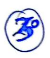

$$\mathbf{V_2>V_1}$$

Cuando una onda pasa de un medio 1 a otro medio 2, su frecuencia no varía. Como su velocidad depende de la longitud de onda y del periodo (que es el inverso de la frecuencia), podemos expresar: $V = \frac{1}{f} \lambda$. Si aumenta la velocidad y la frecuencia es la nuima, la longitud de onda también aumentara!  $\lambda_2 > \lambda_1$ .

Para estudiar el cambio en la dirección de propagación consideremos una onda plana que incide con un angulo I con la normal de la superficie de separación de ambos medios.

El frente de onda incide, inicialmente en el punto (a) de la superficie de separación de ambos medios.

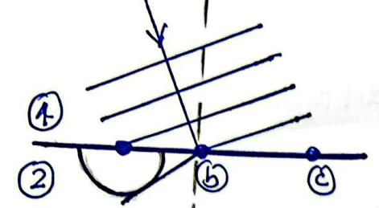

Cuando el frente de onda llega al punto (b), el punto (a), que por el principio de Huygens, se ha convertido en un nuevo foco emisor, ha emitido la onda generando un nuevo frente.

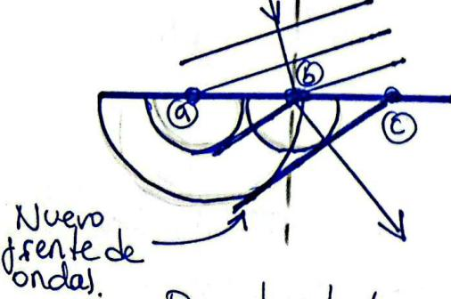

Cuando el frente de onda llega al punto (c), los puntos de la superficie, que se han convertido en nuevos focos, han emitido respectivas ondas cuya envolvente es el nuevo frente de ondas.

Por tanto, la onda se aleja de la normal.

4) Cuando una onda que se propaga en un medio A pasa a otro medio B, se reduce su longitud de onda a la mitad. ¿Cómo se modifica la velocidad de propagación de la onda en el segundo medio respecto al primero? ¿Y su periodo? Razone las respuestas. EBAU 2024

(4°) Igual que el (2°)

10 Datos: 
$$f = 3.5 \cdot 10^{14} \text{ Hz}$$
 $n_2 = 1.35$ 
 $x = 60^\circ$ 

A partir de la velocidad de la luz en el aire (que es igual que en el vacío y cuyo valor conocemos) podemos calcular la longitud de onda en dicho medio mediante la siguiente expresión:

$$C_{1} = \frac{\lambda_{1}}{T} = \lambda_{1} \frac{1}{f} \rightarrow \lambda_{1} = \frac{C}{f} = \frac{3 \cdot 10^{8} \, \text{m/s}}{3.5 \cdot 10^{14} \, \text{Hz}} = \frac{8.6 \cdot 10^{-7} \, \text{m}}{3.5 \cdot 10^{14} \, \text{Hz}}$$

Por otro lado sabemos que el indice de refracción de un medio es el cociente entre la velocidad de la luz en el vacío (c) y en dicho medio:  $N_2 = \frac{C}{V_2}$  Como la frewencia no varia, podemos expresar dicho indice del siguiente modo:  $N_2 = \frac{f\lambda_1}{f\lambda_2} = \frac{\lambda_1}{\lambda_2}$  Y por tento  $\lambda_2 = \frac{\lambda_1}{N_2} = \frac{816\cdot10^{-7}m}{1135} = \frac{6.37\cdot10^{-7}m}{6.37\cdot10^{-7}m}$ 

El ejercicio nos dice que el rayo forma un cinquelo de  $60^{\circ}$  con la superficie de separación de ambas medias, por lo tanto:  $\Omega = 90^{\circ}-60^{\circ}-30^{\circ}$ 

Reflexion: Por la ley de Snell para la reflexion;  $\widehat{\mathcal{L}} = \widehat{\Gamma} = 30^\circ$ .

Refracción: Por la ley de snell para la refracción:  $n_1 \operatorname{sen} \lambda = n_2 \operatorname{sen} \hat{r}$ . Por tanto:  $1 \operatorname{sen} 30^\circ = 1,37 \operatorname{sen} \hat{r}$ .  $\hat{r} = \operatorname{arcsen} \left( \frac{1 - \operatorname{sen} 30^\circ}{1,35} \right) = 21,7^\circ$ .

Graficamente:

N=1

Cire

material

N=1,35

Escaneado con CamScanner

Dates: 
$$\hat{\lambda} = 43^{\circ}$$
 $d = 140^{\circ}$ 

Aire  $N_1=1$ Vidrio  $N_2=?$ 1100

Por la ley de Snell para la reflexión, calculamos el angulo de reflexión:

$$\hat{\mathcal{L}} = \hat{\mathcal{L}} = 43^{\circ}$$

Por otea parte,  $\hat{\Gamma}_{x}$  (angulo de reflexion), 110° y  $\hat{\Gamma}_{c}$  (angulo de refracción) son suplementarios (suman 180°) podemos expresar:  $180^{\circ} = \hat{\Gamma}_{x} + 110^{\circ} + \hat{\Gamma}_{c} \rightarrow \hat{\Gamma}_{c} = 180^{\circ} - 110^{\circ} - \hat{\Gamma}_{x} = 180^{\circ} - 110^{\circ} - 43^{\circ} = 24^{\circ}$ 

Aplicando la ley de Snell para la refracción: NISENT = 12 SENTE - N2 = NISENT = SEN 43° = 4,5 SEN ETE - SEN ETE

Finalmente:  $N_2 = \frac{c}{V_2} = 1.5 \Rightarrow V_2 = \frac{c}{1.5} = \frac{3.10^8}{1.5} = 2.10^8 \text{ m}$ 

La velocidad de la lut en el victrio serà  $\sqrt{2}=2\cdot10^8 \text{m}$ 

 $3^{\circ}$   $n_{\lambda} = 1$  (aire)  $n_{\lambda} = ?$   $2^{\circ} = 60^{\circ}$ 

<= 90°

Operando igual que en el ejercicio anterion:

Por Snell:  $\hat{\chi} = \hat{\zeta}_{x} = 60^{\circ}$ 

Alogulos suplementarios: 180°= 12+90°+12

Por tanto, angelo de refracción: R=180-60°-90°=30°

Aplicando la ley de snell para la refraccion:

 $n_{1} \operatorname{sen} \widehat{\mathcal{L}} = n_{2} \operatorname{sen} \widehat{\mathcal{L}} \rightarrow n_{2} = \frac{n_{1} \operatorname{sen} \widehat{\mathcal{L}}}{\operatorname{sen} \widehat{\mathcal{L}}} = \frac{\operatorname{sen} 60^{\circ}}{\operatorname{sen} 36^{\circ}}$ 

Finalmente: n = 1,73

Datos: 1 = 30° 1 lagua = 1,33 AIRE VIDRIO AGUA naire=1 Nvidrio=7 Nagra = 1,33 Aplicamos Snell a la primera refracción cirre-vidrio. naire sen I = Nvidros sen Pridro Aplicamos Snell a la seginda siperficie vidrio-agua. Nuidrio - Sen Dvidrio = Nagua · Sen Vagua Como ambos superficies son planas y paralelas, se comple que el digilo con el gre la lut entre al Vidrio Pridrio es ignal al angulo con el gre

sale Ruidrio - Por tanto Ridrio - Luidrio.

Escaneado con CamScanner

Si sustituimes en la ley de snell de la primore refracción: naire sen? = nvidro sen Ividro que combinada con la expresión para la segunda: Naire sen I = Nudrio sen Ividno = Nagra sen l'agra. la superficie 2º superficio. Por tanto: Naire sení = Nagra sen Paga Vagua = arcsen  $\frac{\text{Naire sení}}{\text{Nagra}} = \text{arcsen} \frac{\text{sen } 30^{\circ}}{1,33} = 22,1^{\circ}$ Como nos pide que calalemos el digulo gue Joinna et rayo con la pared de vidrio,  $\alpha$ , y ambos suman  $90^\circ$ :  $\alpha = 90 - 221 = 67,9°$ D) Sabemos que  $n = \frac{C}{V}$  siendo C = velocidadde les lut en el vació o en el aire y V la relocidad en el medio con indice de refracción N. Podemos expresar:  $N = \frac{d \cdot \lambda vacio}{dagan} = \frac{d vacio}{dagan} \rightarrow \lambda agan = \frac{\lambda vacio}{\log n} = \frac{5 \cdot 10^{-7}}{\log n} = \frac{3 \cdot 76 \cdot 10^{-7}}{\log n}$ Y la velocidad: V= == 2,26 · 108 m/s.

Podemos calular el indice de refracción del ogra:  $N = \frac{C}{V} = \frac{3.108 \,\text{m/s}}{2,25.108 \,\text{m/s}} = 1,33$ 

Si el rayo no sale del agra, es porque se produce el jordineno de la reflexión total. Es decir, el angulo de invidencia en la superficie agra-aire es tal que el ongulo de refración es 90°. A este angulo de invidencia le llamamos angulo limite y para angulos mayores el vayo no atraviera la superficie y se refleja completamente. Imponiencho la condición de angulo limite en la ley de Snell:

Naga-senl = Naire sen 90° → l= 48,8°

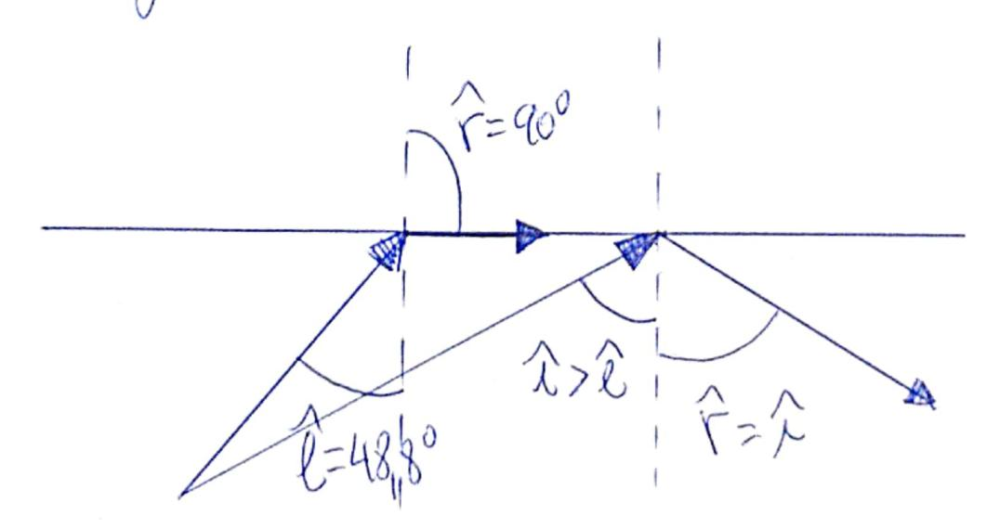

Podemes definir el fenómeno de reflexión a total como el que se produce wando un vayo de luz atraviesa una superficie de separación desde un medio con Indice de refracción menor Ma M2 a otro de indice de refracción menor Ma M2, refractandose de tal modo que no es capaz de atravesar dicha superficie de separación (porque el angulo de refracción es mayor o igual a 90°), y se refleja completamente volviendo al primer medio.

De Además, Mamamos angulo linuite, l, al angulo de incidencia al cual corresponde un angulo de refracción de 90°. Para angulos mayores que l, se producirá la reflexión total.

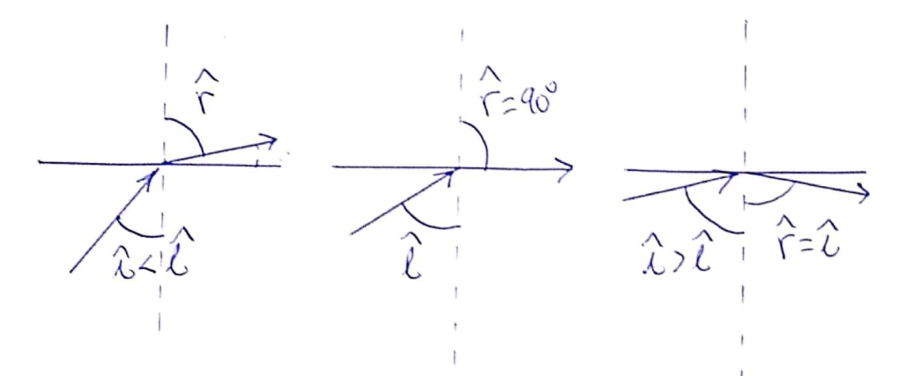

Otro modo de representarlo es:

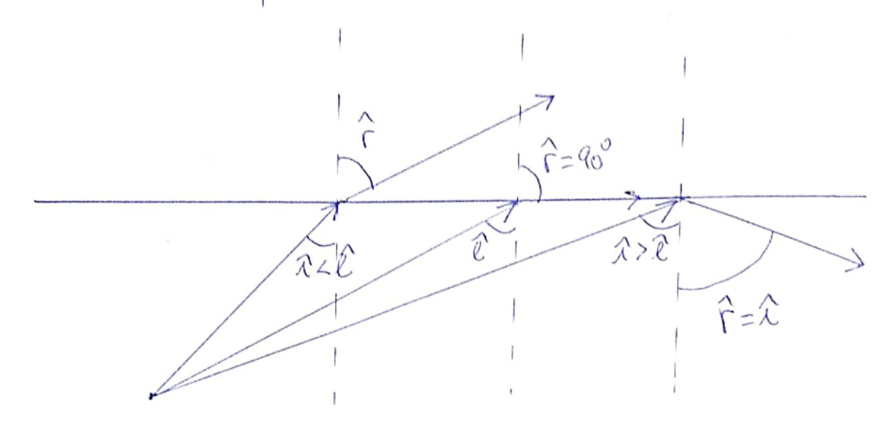

Naire = 1

Una condición indispensable para que se produzca la reflexion total es que la luz pare del medio de mayor indice al de menor. Por tanto, se produció si la lut para del agra al aire y nuna a la ser mayor que el dingulo limite l: i>l Aplicando Snell: nagua: sen 2= Naire: Jen 900

7º) Elamamos angulo limite, é, al angulo de incidencia al cual corresponde en digito de refraccion de 90°. Para que se preda producir este hecho, la lut debe pasar de in ains medio de Indice de refracción 1/2 a otro de indice na menor. Segn la ley de snell para la refracción, el angulo de refracción depende del primer medio (de su indice de refracción) pero tembién del segundo. Es decil: My sen l= N2 sen ?= N2 sen 90° Por tanto: l=arcsen (n2 sen 900) 1 = arcsen M2

Por tanto, la afirmación del enunciado es falsa.

(8°) & hace ignal gre et (5°) V= 1,25 -108 m/s  $n_{domark} = \frac{c}{V} = \frac{8.10^8 m/s}{1,25.10^8 m/s} = 2.4$ l'=arcsen Maire = 24,6°
Ndigmonte

The sportage (a) se have como el (29)  $1 = 30^{\circ}$  Shell  $1 = 30^{\circ}$ X=130°

Condición de angulos suplementarios:  $\hat{r_c} = 20^\circ$ Ley Snell:  $n_1 \sin 30^\circ = n_2 \sin 20^\circ \rightarrow n_2 = 1,146$ Por tanto:  $V_2 = \frac{C}{1.46} = 2.10^8 \text{ m/s}$ .

(b) Se hace como el 6.b.

l=arcsen Maire Jen 900 = 43,20
Niguido = 43,20

Para que el rayo se refleje completamente en la cara superior del blogue, clebe incidir con un angulo igual o superior al angulo limite, es decir, clebe producirse reflexión total. El angulo limite l'se corresponde con un angulo de refracción de 90°. Imponiendo estas condiciones a la ley de Snell:

Calculemos ahora el dingulo con el que sale de la superficie aire-vidros: Paire-vidros

Ahora, sabiendo el ángulo de refracción, ra-v, de la superficie aire-victrio, podemos, con snell, calculor el angulo de incidencia: Naie Sen I=N vidro sen34,8° = 67,6°

Escaneado con CamScanner

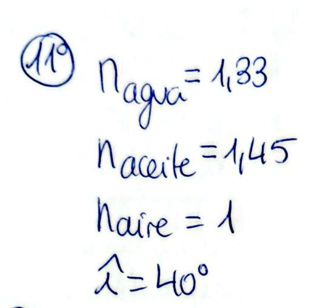

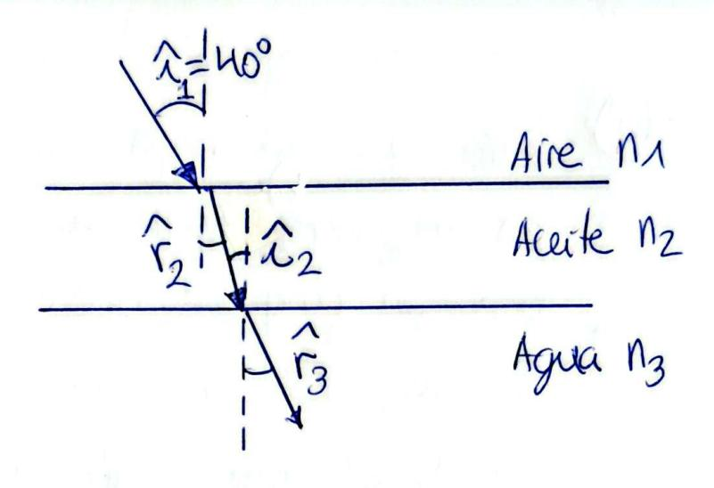

(a) Aplicamos snell a la prinera refracción:  $N_{1} \sin \hat{L}_{1} = N_{2} \sin \hat{V}_{2}$ 1. Sen 40 = 1,45. sen 2 > 1/2 = 263°

Como las dos superficies son planas y  $\tilde{r}_2 = \tilde{l}_2$ Aplicamos Snell a la segunda refracción:

 $N_2$ -sen  $l_2 = N_3$  sen  $l_3$ 1,45-sen 26,3 = 1,33-sen 13 > 13 = arcsen 1,45 sen 26,3  $\rightarrow \hat{r}_3 = 28.90$ 

(b) El droplo limite en la sperficie aire-aceite sera: l'= arcsen Maire = 48.80 que sera el angles de refracción de la superficie agra-aceite. Por tento: ngsen 13 = 1/2. sen 48780 43,60

23 = arcsen 1,45.8en 48,16 = 85/120 48,750

- 12) Un rayo láser incide desde el aire sobre la superficie plana de un material con un índice de refracción 1,55. El rayo incidente y el reflejado forman entre sí un ángulo de 60°. Dibuje el diagrama de rayos correspondiente y calcule el ángulo que formará el rayo refractado en el material con el rayo reflejado en el aire. EBAU 2023
- 13) El índice de refracción de un cierto líquido para la luz de color rojo es 1,32 mientras que para el color violeta es 1,35. Sobre un recipiente de 50 cm de altura lleno de este líquido se hace incidir un rayo de luz blanca formando un ángulo de 60° con la superficie del líquido. Determine la separación entre los rayos rojo y violeta cuando alcancen el fondo del recipiente. EBAU 2023

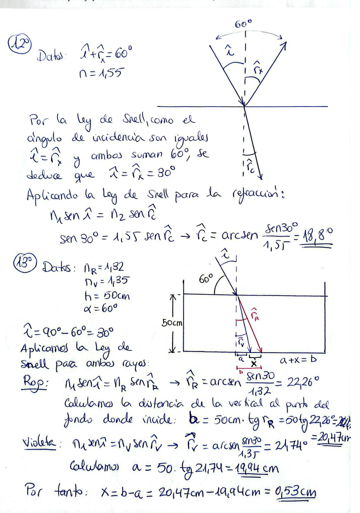

- 14) Un buceador enciende una linterna bajo el agua (índice de refracción nagua = 1,33) y dirige el haz luminoso hacia arriba formando un ángulo de 40° con la vertical. ¿Con qué ángulo emergerá la luz del agua? ¿Cuál sería el ángulo de incidencia a partir del cual el haz no saldría al aire? EBAU 2024
- 15) Un rayo de luz de frecuencia 5,2·1014 Hz incide desde el agua (nagua = 1,33) sobre la superficie de separación agua-aire de un lago, formando un ángulo de 60° respecto a la superficie del agua. Determine la longitud de onda del rayo en cada uno de los medios y el ángulo que forman entre sí el rayo reflejado y el refractado. EBAU 2024

(14°) 
$$n_{agra} = 1.33$$
 $R = 40°$  or  $n_{agra} = 1.33$ 

à = 40°

a) Snell: 
$$n_{agua} \cdot sen \widehat{A} = n_{aire} \cdot sen \widehat{r}$$
  
 $1,33 \cdot Hn40^{\circ} = 1 \cdot Hn \widehat{r}$ 

b) nagura sen 
$$\hat{l} = naire \cdot xn qo^{\circ}$$
  
 $\hat{l} = arcsen \frac{1.1}{1,33} = 48.75^{\circ}$ 

(5°) 
$$f = 5/2 \cdot 10^{14} \text{ Hz}$$
  
Nagra =  $1/33$   
 $x = 60^{\circ} \rightarrow \hat{\lambda} = 90^{\circ} - 60^{\circ} = 30^{\circ}$   
Nagra =  $\frac{C}{1/33} \rightarrow \sqrt{3}$ 

Nagura = 
$$\frac{C}{Vagura} = 1.33 \rightarrow Vagura = \frac{C}{1.33}$$
  
Como  $V = \lambda \cdot f \rightarrow \lambda = \frac{V}{f} \rightarrow \lambda \text{ arise} = \frac{3 \cdot 10^8 \text{ m/s}}{5.12 \cdot 10^{14} \text{s}^{-1}} = \frac{5.7 \cdot 10^{-7} \text{ m}}{5.12 \cdot 10^{14} \text{s}^{-1}} = \frac{3 \cdot 10^8 \text{ m/s}}{5.12 \cdot 10^{14} \text{s}^{-1}} = \frac{4.3 \cdot 10^{14} \text{s}^{-1}}{5.12 \cdot 10^{14} \text{s}^{-1}}$ 

Snell Magar-8en 
$$\lambda = Naize \cdot Sen$$
?

133 · Sen 30° = 1 · Sen ?

N=30°+90°+(90°-41,7°)=168,3°.

16) Un haz de luz pasa de un medio en el que su velocidad de propagación es v1 a otro en el que su velocidad es v2, siendo v2 > v1. Razone si puede tener lugar el fenómeno de reflexión total. EBAU 2024

(6°) V1 < V2 ciReflexion total ?

Introducción explicando la reflexión total: ejercicio 6°.

Si  $n = \frac{c}{V}$  y  $V_2 > V_4 \rightarrow N_4 > N_2$ . Aplicando

Snell para et calculo del angulo limite I:

 $n_{\lambda}$  sen  $L = n_{2}$  sence  $\rightarrow L = a \kappa sen \frac{n_{2}}{n_{1}}$ 

Como no 1, condulmos que si es possible

calular î y si se producirá reflexión total para 1>1.

17) El rayo de luz de la figura se propaga por el interior de cierto medio e incide sobre la superficie que lo separa del aire. Las dimensiones mostradas en el diagrama corresponden justamente al ángulo límite. Determine el índice de refracción del medio. PAUor 2025. (1 punto)

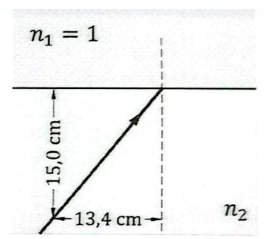

Usando el razonamiento del ejercicio anterior: 
$$1 = n_2 \operatorname{sen} L \quad \text{if } L = \operatorname{arctg} \frac{13,4 \, \mathrm{cm}}{15,0 \, \mathrm{cm}} = 100 \, \mathrm{cm}$$

$$n_2 = \frac{1}{8en(41.78^\circ)} = 1.5$$

18) La esquina inferior de una piscina se encuentra a 2 m bajo la superficie del agua (n = 1,33). Desde esa esquina se emite un rayo de luz hacia arriba, que llega a la superficie del agua formando un ángulo de 40° con la vertical. a) ¿Cuál es la velocidad de la luz en el agua? ¿Qué ángulo forma con la vertical el rayo que sale del agua? (1 punto) b) Si un observador percibe este rayo, ¿a qué profundidad le parece que está la esquina de la piscina? (1 punto). PAUex 2025

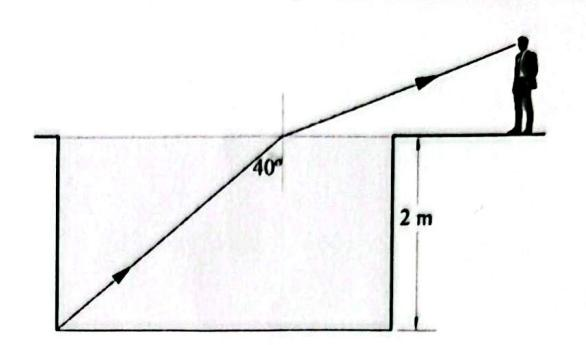

h=2m nagra = 1,33 2 = 40°

a)  $n = \frac{C}{V} = 1/33 \rightarrow V = \frac{C}{N} = \frac{3 \cdot 10^8 \, \text{m/s}}{1/33} = \frac{226 \cdot 10^8 \, \text{m/s}}{1/33}$ 

Por Snell: Naga. Sen? = Naire sen?

tg 40°= x → x = 1,678 m